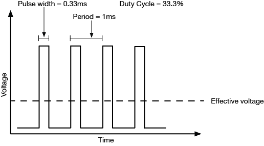

# Theory of Operation

This device measures the capacitance of the soil indirectly.

## Signal Generation

A 1.5MHz PWM signal with a 34% duty cycle is output to the probe via pin 17. The output waveform will look something like this repeated 1.5 million times per second.

N.B. The period will be `1s / 1.5 million = 6.7 x 10^-7s` and the pulse width witll be `1s /1.5 million x 34% = 2.3x10^-7s`.

The selection of the frequency is important. The papers all agree that a higher frequency is recommended especially to reduce the difference that the soil type makes (e.g. coconut coir vs clay vs sand, etc.). The scientific paper I consulted suggested 70MHz however other papers suggest that 500MHz is required.

In any event, the ESP32 can output a maximum frequency of 40MHz but at this frequency the output is very inaccurate (i.e. the readings will vary widely even in the same soil medium). I have chosen 1.5MHz because in my short term testing that was the highest frequency that was reasonably stable and accurate. There is potentially some optimisation possible because there would be [an optimal frequency allowing for maximum bit depth in that range of frequency](https://www.esphome.io/components/output/ledc.html). However, in my short term testing 1.5MHz seemed relatively suitable - note this device is not intended for scientific testing but more to provide a relative range whereby automated irrigation can be turned on.

A 34% duty cycle is selected because the ESP32's ADC is capable of measuring voltages upto ~1.1V. Using an output voltage of 3.3V, a 34% duty cycle should give a maximum resultant voltage of around 1.1V. This resultant voltage would only occur if the sensing wires of the probe were shorted together (which shouldn't be possible). Accordingly, given that air, soil and water are far from ideal dielectrics (see below) we expect resultant voltages far below this.

## Dielectric effect.

We expect that the two probe wires which are seperated by a 2mm gap should function as a capacitor (even in air) due to the dielectric effect. This is because when a voltage difference is applied to the two probe wires we expect charge seperation to occur and for there to be a net flow of electrons to the negative wire and away from the positive wire.

This effect also works in the case of a [planar capacitor](https://makersportal.com/blog/2020/5/26/capacitive-soil-moisture-calibration-with-arduino) although we expect the dielectric effect to be significantly weaker than for a traditional parallel plate capacitor.

Among other things, we expect that this capacitance will differ depending on the dielectric material placed next to the plates (i.e. air, dry soil, wet soil). In particular, wet soil is a far better dielectric material than dry soil, so we expect it to retain more charge when the PWM signal is turned on. This results in a lower voltage being read via from the ADC on pin 9.

## Calibration

This dielectric effect differs with (at least):
1. Temperature
2. Salinity
3. Soil Type
4. Soil pH

In order to calibrate the sensor you should:
1. Have 2 cups of the soil type/ mix you are using.
2. For cup 1 dry the cup in a dehydrator or oven. I recommend around 60-70C maximum if using an oven otherwise you will infuse your oven with burnt soil smells.
3. For cup 2 pierce the bottom of the cup with several drainage holes. Fill the cup with water until all of the soil is saturated with water and it overflows. Leave the cup to drain for about 30 minutes in a relatively cool place.
4. Allow the cups to reach a stable temperature in the place you will be performing the measurements.
5. Place the probe in cup 1. Allow it to settle for around 30s. Using the ESPHome logger and note the raw moisture reading (I recommend averaging several readings). This average should be your 0% moisture level.
6. Place the probe in cup 2. Allow it to settle for around 30s. Using the ESPHome logger and note the raw moisture reading (I recommend averaging several readings). This average should be your 100% moisture level - the raw moisture reading should be lower than for the dry media.
